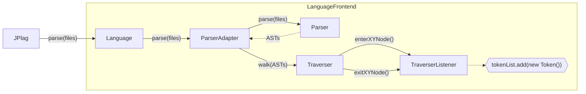

# Frontend Structure

A frontend consists of these parts:

| General parts/files   | Superclass                | Function                                         | How to get there                                            | 
|-----------------------|---------------------------|--------------------------------------------------|-------------------------------------------------------------|
| Language class        | `de.jplag.Language`       | access point for the frontend                    | copy with small adjustments                                 |
| `pom.xml`             | -                         | Maven submodule descriptor                       | copy with small adjustments;<br>add dependencies for parser |
| `README.md`           | -                         | documentation for the frontend                   | copy for consistent structure; adjust from there            |
| Token class           | `de.jplag.Token`          | contains constructor(s) and `type2string` method | copy constructors, **implement `type2string` new**          |
| TokenConstants class  | `de.jplag.TokenConstants` | contains constants used as token types           | **implement new**                                           |

| Parser technology <br>specific parts/files | Superclass                | Function                           | How to get there      | 
|--------------------------------------------|---------------------------|------------------------------------|-----------------------|
| Lexer and Parser                           | -                         | transform code into AST            | depends on technology |
| ParserAdapter class                        | `de.jplag.AbstractParser` | sets up Parser and calls Traverser | depends on technology |
| Traverser/<br>TraverserListener classes    | -                         | creates tokens traversing the AST  | depends on technology |

For example, if ANTLR is used, the setup is as follows:

| Antlr specific parts/files | Superclass                     | Function                           | How to get there                                                                             |                                   
|----------------------------|--------------------------------|------------------------------------|----------------------------------------------------------------------------------------------|
| Grammar files  (`.g4`)     | -                              | capture syntax of the language     | most likely available in [ANTLRv4 Grammar Repository](https://github.com/antlr/grammars-v4/) |
| Lexer and Parser           | `Lexer`, `Parser` (ANTLR)      | transform code into AST            | generated from grammar files by antlr4-maven-plugin                                          |
| Traverser                  | `ParseTreeWalker` (ANTLR)      | traverses AST and calls listener   | included in antlr4-runtime library, can be used as is                                        |
| TraverserListener class    | `ParseTreeListener` (ANTLR)    | creates tokens when called         | **implement new**                                                                            |
| ParserAdapter class        | `de.jplag.AbstractParser`      | sets up Parser and calls Traverser | copy with small adjustments                                                                  | 

As the table shows, much of a frontend can be reused, especially when using ANTLR. The only parts left to implement specifically for each frontend are
 - the ParserAdapter (for custom parsers)
 - the TokenConstants and their String representation, and
 - the TraverserListener.

**Note** for parser libraries other than ANTLR:
  - It should still be rather easy to implement the ParserAdapter from the library documentation.
  - Instead of using a listener pattern, the library may require you to do the token extraction in a _Visitor subclass_. In that case, there is only one method call per element, called e.g. `traverseClassDeclaration`. The advantage of this version is that the traversal of the subtrees can be controlled freely. See the Scala frontend for an example.

### Basic procedure outline



Note: In existing frontends, the TokenList is managed by the ParserAdapter, and from there it is returned to the
Language class and then to JPlag.

### Integration into JPlag

The following adjustments have to be made beyond creating the frontend submodule itself:

- Register the submodule in the aggregator POM for every build profile.
```xml
    <!-- ${jPlagRoot}/pom.xml -->
    <modules>
        ...
        <module>jplag.frontend.my-frontend</module>
        ...
    </modules>
```
- Add a dependency from the aggregator module to the new frontend
- Add a dependency from the jplag module to the new frontend
```xml
    <!-- ${jPlagRoot}/pom.xml -->
    <!-- ${jPlagRoot}/jplag/pom.xml -->
    <dependencies>
        ...
        <dependency>
            <groupId>de.jplag</groupId>
            <artifactId>jplag.frontend.my-frontend</artifactId>
            <version>${revision}</version>
        </dependency>
        ...
    </dependencies>
```

That's it! The new frontend should now be usable as described in the main README. The name of the frontend used with the CLI `-l` option is the `IDENTIFIER` set in the Language class.